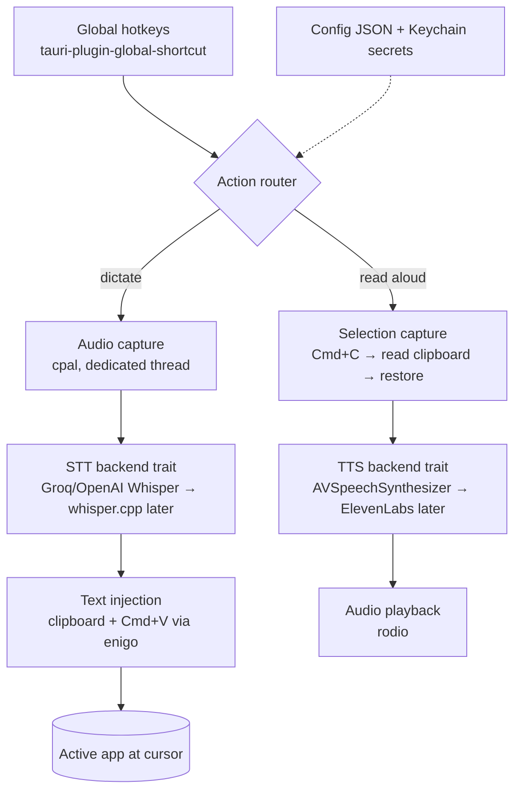

# Voice Tool — Architecture & v1 Build Order

A macOS-only, Tauri v2 desktop app that combines dictation (Wispr Flow–style)
and read-aloud TTS (Speechify-style), with on-device LLM refinement over your
dictation. Built in Rust as a daily-driver tool and a Rust-business
content artifact.

> Scope for v1: **personal use, macOS only.** Cross-platform and "sellable
> product" concerns are explicitly out of scope and should not drive any design
> decision here. When in doubt, pick the simpler macOS-native path.

---

## 1. Design principles

1. **Small always-on Rust daemon.** A tray app with a frameless overlay window.
   The Rust backend owns all system integration; the webview is only for overlay
   UI and settings. Target idle RAM in the low tens of MB (the whole point — Wispr
   sits around 800MB).
2. **Fork, don't rebuild the dictation core.** Start from an MIT-licensed Tauri
   dictation app (Handy is a clean base) to inherit permissions flow, the
   clipboard-paste injection, and the recording overlay. Spend net-new effort on
   the parts that are actually yours: read-aloud TTS and the refinement layer.
3. **Pluggable backends behind traits.** STT, TTS, and the refine LLM
   should each sit behind a trait so you can swap cloud ↔ local without touching
   call sites. v1 leans cloud for speed; local is a later upgrade.
4. **The overlay is where "smooth" is won.** Latency, waveform feedback, instant
   cancel (Esc), and reliable clipboard restore matter more than features. Budget
   real time for this.

---

## 2. High-level architecture



---

## 3. Tech stack

| Concern | Choice | Notes |
|---|---|---|
| App shell | Tauri v2 | Rust backend + webview overlay/settings |
| Hotkeys | `tauri-plugin-global-shortcut` | Register on the **main thread** (macOS requirement) |
| Audio in | `cpal` | 16kHz mono, dedicated capture thread, ring buffer |
| Audio out | `rodio` | TTS playback + controls |
| STT (cloud, v1) | Groq Whisper or OpenAI via `reqwest` | Groq is the fastest cold path |
| STT (local, later) | `whisper-rs` (whisper.cpp) | Metal acceleration on Apple Silicon |
| VAD (optional) | Silero via `ort` (onnxruntime) | Auto-stop on silence |
| Keystroke / paste | `enigo` + `arboard` | Clipboard-paste is the only reliably cross-app injection (works in Electron apps) |
| TTS (v1) | `AVSpeechSynthesizer` via `objc2` FFI | Free, offline, decent voices |
| TTS (upgrade) | ElevenLabs / OpenAI TTS via `reqwest` | Speechify-grade voices, paid |
| Refine LLM | local Qwen3 via `llama-cpp-2` (Metal); OpenRouter via `reqwest` optional | On-device by default |
| Secrets | `keyring` | API keys in macOS Keychain, never plaintext |
| Async | `tokio` | API calls |
| Native FFI | `objc2`, `objc2-foundation`, `objc2-app-kit` | AVSpeechSynthesizer, AX API |

---

## 4. Module layout (Rust backend)

```
src-tauri/src/
  lib.rs          // Tauri setup, tray, overlay window, hotkey registration, action router
  hotkeys.rs      // Hotkey → action mapping
  audio.rs        // cpal capture, ring buffer, level events for waveform
  stt.rs          // trait Transcriber { async fn transcribe(&self, wav) -> Result<String> }
  inject.rs       // clipboard save → set → Cmd+V → restore (change-count watch)
  selection.rs    // Cmd+C → read clipboard → restore (reverse of inject)
  tts.rs          // trait Speaker { async fn speak(&self, text) -> AudioStream }
  llm.rs          // LlmChat seam + transform (Fn+Ctrl LLM cleanup)
  local_llm.rs    // embedded llama.cpp (Qwen3) for the refine pass
  config.rs       // JSON config in app support dir
  secrets.rs      // keyring wrappers
frontend/         // overlay (waveform, answer panel, TTS controls) + settings window
```

Pluggable-backend shape, e.g.:

```rust
#[async_trait]
trait Transcriber {
    async fn transcribe(&self, wav: &[u8]) -> anyhow::Result<String>;
}
// GroqWhisper, OpenAiWhisper, LocalWhisper all impl Transcriber.
// The action router holds a Box<dyn Transcriber>; swap via config.
```

---

## 5. macOS gotchas (read before writing code — this is where projects die)

- **The literal Fn key is hard.** `tauri-plugin-global-shortcut` can't capture the
  raw Fn key. Wispr does it via a low-level `CGEventTap`/IOKit listener, which also
  needs **Input Monitoring** permission. **For v1, use a normal chord** (e.g.
  `Cmd+Shift+Space`). Treat Fn as a stretch goal with its own event-tap module.
- **Inject via clipboard paste, not synthetic typing.** Save clipboard → set text →
  simulate `Cmd+V` → restore. This is the only method that works everywhere
  including Electron apps (VS Code, Slack). Restore by **watching the clipboard
  change-count, not a fixed timer**, or you'll race the target app and clobber
  copies. Don't preserve binary clipboard contents (avoids double-paste from
  clipboard managers like Alfred/Paste).
- **`Option+Space` types a non-breaking space** in the frontmost app before the
  shortcut fires — backspace it, or avoid that chord.
- **Selection capture = injection in reverse.** Simulate `Cmd+C`, read the
  clipboard, restore it. The "correct" AX API path (`AXUIElement` selected text) is
  inconsistent across apps; the `Cmd+C` trick is the pragmatic universal method.
- **Register hotkeys on the main thread**, or they silently fail on macOS.
- **Permissions reset on every rebuild if you don't sign stably.** macOS keys
  Accessibility/Screen Recording grants to the code-signing identity. Set up a
  **stable ad-hoc or developer signing identity** so you don't have to re-grant
  Accessibility on every `cargo build`. This will otherwise waste hours.
- **Mic permission failure is silent.** Without Microphone access, macOS feeds the
  app empty audio — recording "works" but the waveform is flat. Detect and surface
  this explicitly.

---

## 6. Permissions matrix

| Permission | Needed for | When to request |
|---|---|---|
| Microphone | Dictation capture | Phase 1, on first record |
| Accessibility | `Cmd+V` inject, `Cmd+C` selection | Phase 1, guide user to System Settings |
| Input Monitoring | Fn-key event tap (only if you do Fn) | Stretch goal |

Each request should fail gracefully with a one-click "Open System Settings" deep
link and a clear explanation in the overlay/settings.

---

## 7. v1 build order

Each phase ends with a usable, testable milestone. Ship phase 1 to yourself before
building anything else.

### Phase 0 — Scaffold
- Fork Handy (or `cargo create-tauri-app`, Tauri v2). Tray icon + frameless
  always-on-top overlay window rendering. One hotkey registered and logging.
- Stable signing identity configured so permissions persist across rebuilds.
- **Done when:** app launches to tray, overlay shows/hides on a hotkey.

### Phase 1 — Dictation MVP (the core loop)
- `cpal` capture on hotkey hold → WAV (16kHz mono) → Groq Whisper → clipboard-paste
  injection with change-count restore.
- Microphone + Accessibility permission UX with deep links.
- **Done when:** hold hotkey anywhere, speak, release, clean text appears at cursor.
  This alone is a daily driver.

### Phase 2 — Make dictation "Wispr-smooth"
- Live waveform in the overlay (audio-level events from the capture thread).
- Latency tuning: kick off the STT request as soon as audio stops; consider
  streaming. Esc to cancel mid-flow. Robust error/empty-audio states.
- Optional: swap in local `whisper-rs` for offline/private mode behind the trait.
- **Done when:** the loop feels instant and never leaves the UI in a bad state.

### Phase 3 — Read-aloud (TTS)
- `selection.rs` (Cmd+C trick) → `AVSpeechSynthesizer` via `objc2` → `rodio`
  playback with play/pause/stop + speed in the overlay.
- Optional: ElevenLabs/OpenAI TTS backend behind the `Speaker` trait for better
  voices.
- **Done when:** highlight text anywhere, hit hotkey, hear it read with controls.

### Phase 4 — Refinement
- Fn + modifier: dictate → LLM cleanup with a user prompt → paste refined text.
  Runs on a shared embedded local LLM (Qwen3 via llama.cpp) by default, with
  OpenRouter as an opt-in cloud backend behind the same trait.
- **Done when:** Fn+Ctrl cleans up messy dictation in place.
- (A voice-macros/commands feature was prototyped here and later removed to keep
  the app focused.)

---

## 8. Explicitly out of scope for v1
- Windows/Linux support (don't add any abstraction for it now).
- Multi-user, accounts, sync, packaging for distribution.
- Fn-key trigger (use a chord; revisit later as its own event-tap module).
- Cloud TTS and local STT are *upgrades*, not v1 blockers.

---

## 9. Content angle (why this is worth the time)
The interesting, teachable Rust surface lives in: the `cpal` capture thread and
ring buffer, the trait-based pluggable backends, `objc2` FFI to
AVSpeechSynthesizer, the clipboard-restore race condition, and the embedded
on-device LLM (llama.cpp) driving the refine pass. Each is a self-contained
build-in-public post. The webview is *not* the story — lead with the Rust engine.
